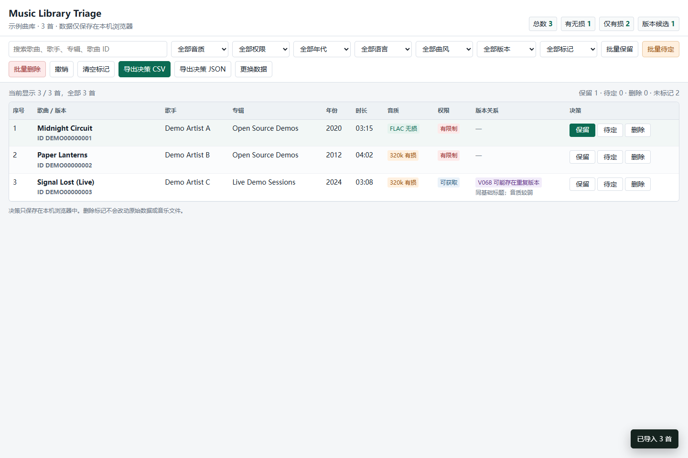

# QQ Music Library Triage

一个完全离线的音乐曲库筛选器。适合处理 QQ 音乐“我喜欢”、歌单导出或本地音乐清单，快速完成搜索、音质筛选、重复版本检查，以及“保留 / 待定 / 删除”标记。



## 特点

- 单文件网页，双击 `index.html` 即可使用
- 数据只保存在浏览器本地，不上传服务器
- 支持 JSON 和 CSV 导入
- 搜索歌名、歌手、专辑、歌曲 ID
- 按音质、权限、年代、语言、曲风、重复版本筛选
- 单曲标记和批量标记
- 支持撤销和清空
- 标记自动保存在 `localStorage`
- 支持导出决策 CSV 和 JSON
- 无 CDN、无远程字体、无追踪脚本

## 直接使用

1. 下载或克隆本仓库。
2. 双击 `index.html`。
3. 导入自己的 JSON 或 CSV。
4. 用筛选器找出需要处理的歌曲。
5. 标记保留、待定或删除。
6. 导出决策文件。

仓库自带 `examples/sample-library.json`，打开页面后可以直接点“加载示例”体验。

也可以启动一个本地静态服务器：

```bash
npx serve .
```

或者使用任意静态文件服务器。仅使用导入功能和内置示例时，直接双击 `index.html` 也可以。

## 输入格式

推荐使用 JSON：

```json
{
  "summary": {
    "playlistName": "我喜欢",
    "total": 3
  },
  "rows": [
    {
      "index": 1,
      "title": "Midnight Circuit",
      "singer": "Demo Artist A",
      "album": "Open Source Demos",
      "year": 2020,
      "duration": "03:15",
      "mid": "DEMO00000001",
      "quality": "FLAC 无损",
      "lossless": "有无损",
      "hires": "否",
      "flac": "是",
      "permission": "有限制",
      "duplicate": "",
      "group": ""
    }
  ]
}
```

CSV 至少需要一列 `title`，推荐包含：

```text
index,title,singer,album,year,duration,mid,quality,lossless,hires,flac,permission,duplicate,group
```

也兼容整理表里的中文列名，例如 `歌曲名`、`歌手`、`专辑`、`最高音质`。

## 状态保存

标记保存在浏览器当前站点的 `localStorage` 中：

- 刷新页面不会丢失
- 关闭再打开不会丢失
- 清理浏览器站点数据会丢失
- 导入不同的数据会切换为对应数据集

如需长期保存，定期导出决策 JSON。

## 隐私

本工具不联网、不上传数据、不包含统计服务。导入的数据只进入当前页面内存和浏览器本地存储。

## 部署到 GitHub Pages

仓库包含 `.github/workflows/pages.yml`。把代码推到 `main` 后：

1. 打开仓库 `Settings > Pages`。
2. 在 `Build and deployment` 中选择 `GitHub Actions`。
3. 等待 workflow 完成。

## 开源协议

MIT License。
